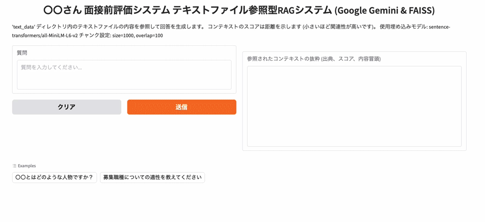

# 🧠 Portfolio

ようこそ！このポートフォリオでは、**画像処理技術**や**生成AI**を中心としたプロジェクトやブログ記事を紹介しています。  
画像補正・レタッチ技術、法制度との接点、LLM開発など、実務に根ざした幅広い取り組みを行っています。

---

## 生成AIを用いた人物像確認システム

LLMを用いた簡単なRAGシステムを作成しました。以下の手順で環境を準備し、システムを実行してください。



---

### 環境準備

1. **Pythonのインストール**  
   Python 3.10以上が必要です。以下のコマンドでインストールされているPythonのバージョンを確認してください。

   ```bash
   python --version
   ```

2. **仮想環境の作成（推奨）**  
   仮想環境を使用することで、依存関係の競合を防ぐことができます。

   #### Condaを使用する場合
   以下のコマンドを実行して仮想環境を作成し、アクティベートしてください。

   ```bash
   conda create -n portfolio-rag python=3.8
   conda activate portfolio-rag
   pip install -r requirements.txt
   ```

3. **データの準備**  
   - `data`フォルダ下にPDFファイルを格納してください（例: 職務経歴書、履歴書、求人情報）。
   - `embedding.py`を用いて`data`下のファイルをテキスト化してください

4. **APIキーの設定**  
   - [Google Studio](https://aistudio.google.com/app/apikey)からAPIキーを発行してください。
   - ターミナルで以下のコマンドを実行し、APIキーを環境変数に登録してください。

     **Macの場合**:
     ```bash
     export GOOGLE_API_KEY="あなたのAPIキー"
     ```

     **Windowsの場合**:
     ```bash
     set GOOGLE_API_KEY="あなたのAPIキー"
     ```

5. **システムの起動**  
   以下のコマンドを実行してください。

   ```bash
   python portfolio-rag.py
   ```

   起動後、URLが発行されます（例: `http://127.0.0.1:7860`）。ブラウザでアクセスしてください。

6. **質問の実行**  
   インターフェースに人物に関する質問を入力してください。適性などの評価結果が表示されます。

---

## 🚀 使用技術・スキルスタック

<p align="left">
  
  
  
  
  
</p>

---

## 🔍 生成AI関連の取り組み

### 📌 札幌DXモデル創出事業（公共導入事例）
- [詳細はこちら（PDF）](https://www.city.sapporo.jp/keizai/seikajirei/documents/r6_p17_low.pdf)

### ⚖️ AI画像生成の法的リスクと対応
- [著作権に関するリスク](https://www.chowagiken.co.jp/blog/generativeai_copyright)  
- [法的リスクの詳細](https://www.chowagiken.co.jp/blog/generativeai_legalrisks)

### 🤖 Azure OpenAI とLLM開発
- [PythonプログラミングとLLM](https://www.chowagiken.co.jp/blog/llm-python-programming)  
- [LangChainを活用した開発](https://www.chowagiken.co.jp/blog/python_langchain)

---

## ✍️ 技術ブログ執筆

- [SAMについての解説（Segment Anything Model）](https://www.chowagiken.co.jp/blog/sam_parameter)

---

## 🖼️ 画像処理技術の研究・実装

- [プリントシール機の「うつり」を作る画像処理技術（学会論文）](https://www.jstage.jst.go.jp/article/itej/69/11/69_859/_pdf)

- [不良品の学習データが必要ない「良品学習」の異常検知エンジンのご紹介](https://www.dts-insight.co.jp/seminar/webinar_20240118_chowagiken.html)

---

## 📫 お問い合わせ

技術やプロジェクトに関するご質問・ご相談はお気軽にどうぞ。  
（※ GitHub Issue でご連絡ください）

---
